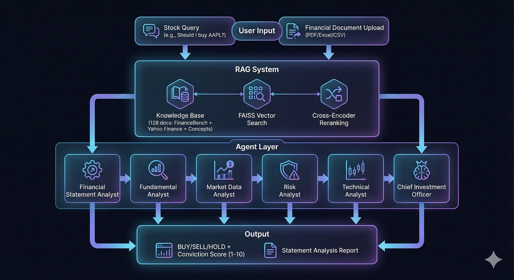
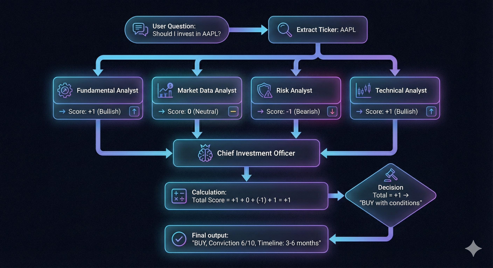
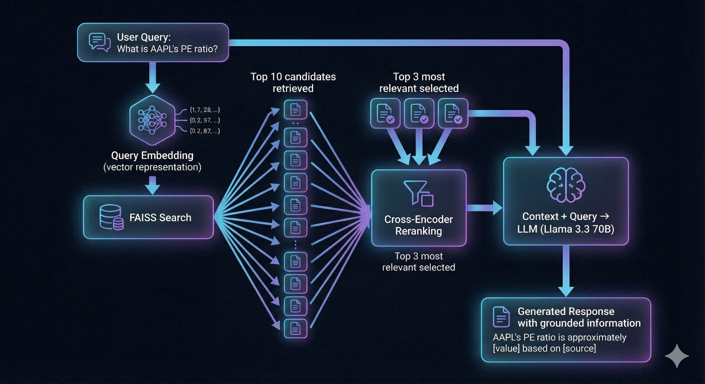
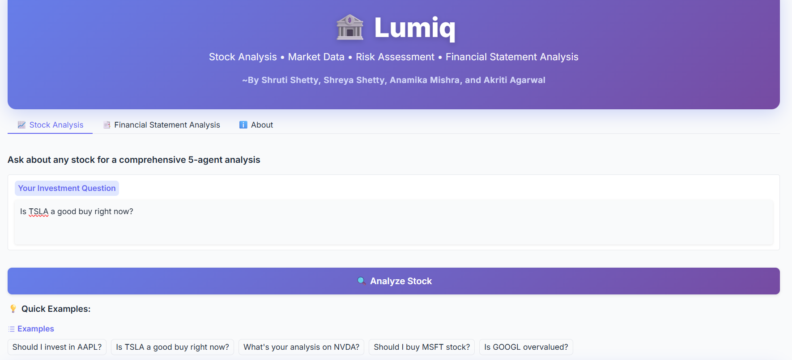
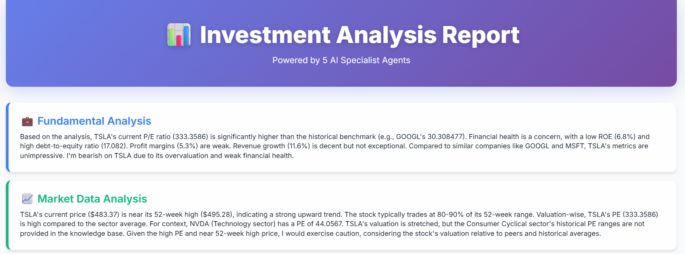
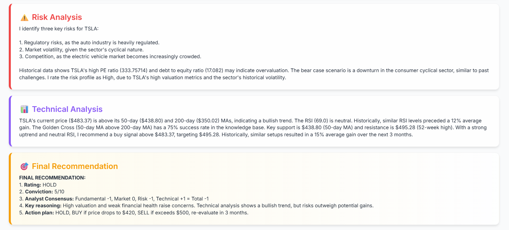
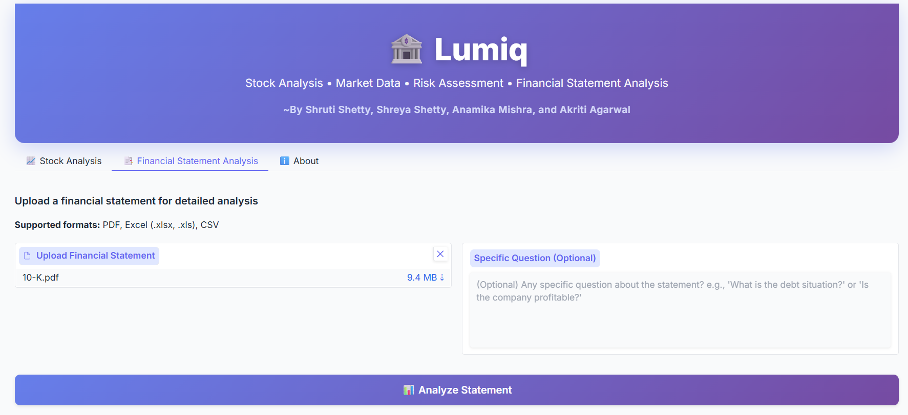
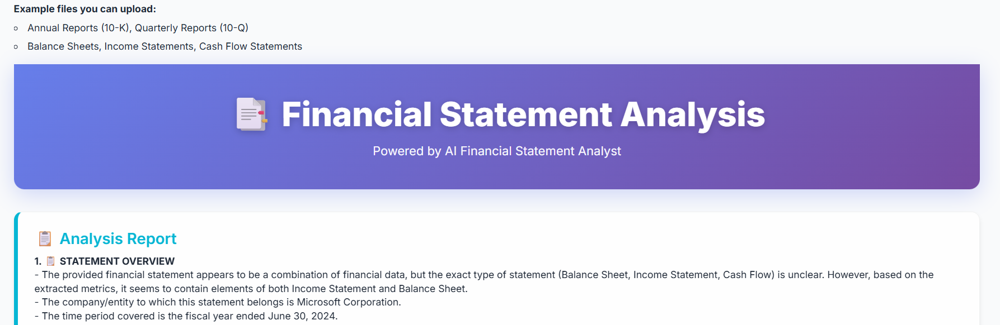
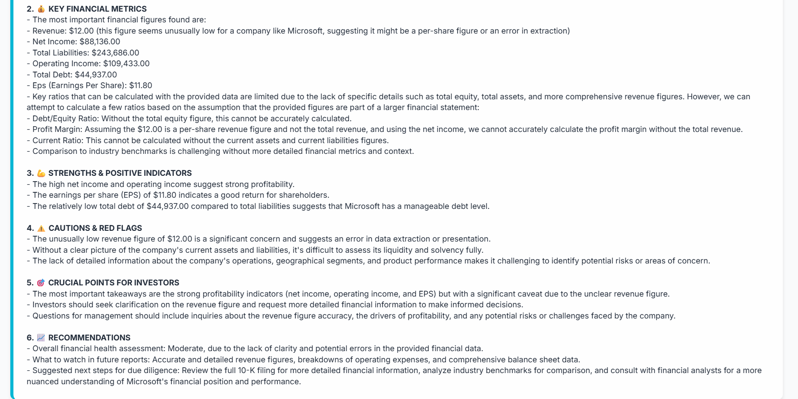

***


# 🏦 Lumiq: Multi-Agent AI Platform for Financial Analysis

A multi-agent RAG-based system that democratizes professional-grade stock analysis and financial document processing through collaborative AI agents.
Made By: Shruti Shetty, Shreya Shetty, Akriti Agarwal, and Anamika Mishra

***

## 🌐 Quick Links

- **🚀 Live Demo**: [https://huggingface.co/spaces/Shruti02222/ai-investment-analyst](https://huggingface.co/spaces/Shruti02222/ai-investment-analyst)
- **💻 GitHub Repository**: [https://github.com/Shruti022/Finance_chatbot](https://github.com/Shruti022/Finance_chatbot)
- **📂 Hugging Face Files**: [https://huggingface.co/spaces/Shruti02222/ai-investment-analyst/tree/main](https://huggingface.co/spaces/Shruti02222/ai-investment-analyst/tree/main)

***


## 📋 Table of Contents

- [Overview](https://github.com/Shruti022/Finance_chatbot/blob/main/README.md#-overview)
- [Features](https://github.com/Shruti022/Finance_chatbot/blob/main/README.md#-features)
- [Architecture](https://github.com/Shruti022/Finance_chatbot/blob/main/README.md#%EF%B8%8F-architecture)
- [Tech Stack](https://github.com/Shruti022/Finance_chatbot/blob/main/README.md#%EF%B8%8F-tech-stack)
- [Installation](https://github.com/Shruti022/Finance_chatbot/blob/main/README.md#-installation)
- [Usage](https://github.com/Shruti022/Finance_chatbot/blob/main/README.md#-usage)
- [API Keys](https://github.com/Shruti022/Finance_chatbot/blob/main/README.md#-api-keys-summary)

***

## 🎯 Overview

Lumiq addresses the gap between expensive professional financial tools (Bloomberg Terminal: $20,000+/year) and free but limited alternatives. It employs **6 specialized AI agents** that analyze investments from complementary perspectives:

- 📊 **Fundamental Analyst** - Financial health metrics
- 📈 **Market Data Analyst** - Price trends and positioning
- ⚠️ **Risk Analyst** - Threat assessment
- 📉 **Technical Analyst** - Chart patterns and indicators
- 👔 **Chief Investment Officer** - Final recommendation synthesis
- 📄 **Financial Statement Analyst** - Document parsing and interpretation

***

## ✨ Features

### 1️⃣ **Stock Analysis Workflow**
- Natural language queries: *"Should I invest in AAPL?"*
- Multi-perspective analysis from 4 specialist agents
- **BUY/SELL/HOLD** recommendations with conviction scores (1-10)
- Actionable plans: entry prices, stop-loss levels, timelines
- Transparent reasoning showing how each agent contributed

### 2️⃣ **Financial Statement Analysis**
- Upload **PDF, Excel (.xlsx/.xls), or CSV** files
- Automatic extraction of key metrics (P/E, ROE, Debt-to-Equity, margins)
- 6-section structured reports:
  - 📋 Statement Overview
  - 💰 Key Financial Metrics
  - 💪 Strengths & Positive Indicators
  - ⚠️ Cautions & Red Flags
  - 🎯 Crucial Points for Investors
  - 📈 Recommendations

### 3️⃣ **RAG-Based Knowledge Grounding**
- **128-document knowledge base:**
  - 115 verified Q&A from FinanceBench dataset
  - 10 live stocks from Yahoo Finance (AAPL, MSFT, GOOGL, AMZN, TSLA, NVDA, META, JPM, V, WMT)
  - 3 core financial concept definitions
- Two-stage retrieval: FAISS vector search → Cross-encoder reranking
- Reduces hallucination by grounding responses in real data

***

## 🏗️ Architecture

Diagram 1: System Architecture (Main Pipeline)


Diagram 2: Multi-Agent Workflow (Flowchart)


Diagram 3: RAG Retrieval Process



**Scoring Logic:**
- Each specialist agent assigns: **+1** (Bullish), **0** (Neutral), **-1** (Bearish)
- Total score = Sum of 4 agents
- **Total ≥ +2** → BUY
- **Total ≤ -2** → SELL
- **Otherwise** → HOLD

***


## 🛠️ Tech Stack

### Core Technologies

**🤖 Language Models**
- **Primary**: Llama-3.3-70B-versatile via Groq API
- **Fallback**: Llama-3.1-8B-instant (automatic rate limit handling)

**🔍 RAG & Retrieval**
- **Embeddings**: all-MiniLM-L6-v2 (384-dimensional)
- **Vector Database**: FAISS with IndexFlatIP for cosine similarity
- **Reranker**: cross-encoder/ms-marco-MiniLM-L-6-v2 for precision retrieval

**📊 Data Sources**
- **Dataset**: PatronusAI/financebench (115 verified financial Q&As)
- **Live Market Data**: yfinance (Yahoo Finance API)
- **Knowledge Base**: 128 documents (115 FinanceBench + 10 live stocks + 3 concepts)

**📄 Document Processing**
- **PDF Parsing**: pdfplumber, PyPDF2
- **Excel/CSV**: openpyxl, pandas
- **Supported Formats**: PDF, XLSX, XLS, CSV

**💻 Frontend & Deployment**
- **UI Framework**: Gradio
- **Deployment**: Hugging Face Spaces
- **Language**: Python 3.10+

***


## 📦 Installation

### Prerequisites

- Python 3.10 or higher
- **API Keys**:
  - **Groq API Key** (get free at [console.groq.com](https://console.groq.com/))
  - **Hugging Face Token** (get at [huggingface.co/settings/tokens](https://huggingface.co/settings/tokens)) - *Only needed for Colab*

***

### Option 1: Use Live Hugging Face Spaces Deployment (No Setup Required!)

**Just visit and use:** [https://huggingface.co/spaces/Shruti02222/ai-investment-analyst](https://huggingface.co/spaces/Shruti02222/ai-investment-analyst)

- ✅ **No API keys needed from users**
- ✅ **No installation required**
- ✅ **Ready to use immediately**
- The app is pre-configured with the GROQ_API_KEY as a secret variable by the developer
- Pre-built RAG files (`financebench_enhanced.pkl` and `financebench_enhanced.faiss`) are already uploaded to the Space

***

### Option 2: Run in Google Colab (Full Build from Scratch)

1. **Open the notebook:**
   ```
   https://github.com/Shruti022/Finance_chatbot/blob/main/Finance_Chatbot_AML_v3.ipynb
   ```
   Click **"Open in Colab"**

2. **Add your API keys to Colab Secrets:**
   - Click the 🔑 **key icon** in the left sidebar
   - Add **TWO secrets**:
     - **Secret 1:**
       - Name: `GROQ_API_KEY`
       - Value: Your Groq API key
     - **Secret 2:**
       - Name: `HF_TOKEN`
       - Value: Your Hugging Face token

3. **Run all cells sequentially:**
   The notebook will:
   - Install dependencies
   - Download FinanceBench dataset from Hugging Face (requires HF_TOKEN)
   - Fetch live Yahoo Finance data for 10 stocks
   - Create embeddings using all-MiniLM-L6-v2
   - Build FAISS index
   - **Generate `financebench_enhanced.pkl` and `financebench_enhanced.faiss` files**
   - Launch Gradio interface

4. **Access your Gradio interface:**
   - A public link will appear: `https://xxxxx.gradio.live`

***

### Option 3: Deploy Your Own Hugging Face Space

1. **First, generate the RAG files in Google Colab** (follow Option 2 above to create the `.pkl` and `.faiss` files)

2. **Download the generated files:**
   - `financebench_enhanced.pkl`
   - `financebench_enhanced.faiss`

3. **Create a new Hugging Face Space:**
   - Go to [huggingface.co/new-space](https://huggingface.co/new-space)
   - Choose **Gradio** as SDK

4. **Upload files to your Space:**
   - Upload `app.py` (modified version that LOADS pre-built files)
   - Upload `financebench_enhanced.pkl`
   - Upload `financebench_enhanced.faiss`
   - Upload `requirements.txt`

5. **Key difference in `app.py` for Hugging Face:**
   ```python
   # LOAD PRE-BUILT RAG (created in Colab)
   print("📦 Loading RAG system...")
   
   df_rag = pd.read_pickle("financebench_enhanced.pkl")
   index_rag = faiss.read_index("financebench_enhanced.faiss")
   embed_model = SentenceTransformer("all-MiniLM-L6-v2")
   
   # Build agents (NO dataset downloading, NO FAISS building)
   agent1 = FundamentalAnalyst()
   agent2 = MarketDataAnalyst()
   # ... etc
   ```

6. **Add GROQ_API_KEY as a Space secret:**
   - Go to Space Settings → Variables and secrets
   - Add: `GROQ_API_KEY` = your key

7. **Your Space is live!**

***

### Option 4: Local Installation (Advanced)

1. **Clone the repository:**
   ```bash
   git clone https://github.com/Shruti022/Finance_chatbot.git
   cd Finance_chatbot
   ```

2. **You need the pre-built RAG files:**
   - Either: Generate them using the Colab notebook first (Option 2)
   - Or: Download them from the Hugging Face Space repository

3. **Create virtual environment:**
   ```bash
   python -m venv venv
   source venv/bin/activate  # On Windows: venv\Scripts\activate
   ```

4. **Install dependencies:**
   ```bash
   pip install -r requirements.txt
   ```

5. **Set environment variables:**
   ```bash
   export GROQ_API_KEY="your-groq-api-key"
   ```

6. **Run the app:**
   ```bash
   python app.py
   ```
   (Assuming you have an `app.py` that loads the pre-built files)

***


## 🚀 Usage

### **Stock Analysis Example**
**Input Query:**
```
Should I invest in SNAP?
```

**Output:**
- 💼 Fundamental Analysis 
- 📈 Market Data Analysis 
- ⚠️ Risk Analysis 
- 📊 Technical Analysis 
- 🎯 Final Recommendations




'
### **Financial Statement Analysis Example**

**Input:** Upload a PDF/Excel financial statement

**Output - Analysis Report Sections:**
- 📋 Statement Overview (company, period, document type)
- 💰 Key Financial Metrics (revenue, net income, ratios)
- 💪 Strengths & Positive Indicators
- ⚠️ Cautions & Red Flags
- 🎯 Crucial Points for Investors
- 📈 Recommendations






***

## 🔑 API Keys Summary

| Platform | Who Needs Keys | GROQ_API_KEY | HF_TOKEN |
|----------|---------------|--------------|----------|
| **Hugging Face Spaces (Live App)** | End users | ❌ No keys needed | ❌ No keys needed |
| **Hugging Face Spaces (Deploying)** | Developer only | ✅ Add as Space secret | ❌ Not needed |
| **Google Colab** | User running notebook | ✅ Required (Colab secret) | ✅ Required (Colab secret) |
| **Local Installation** | User running locally | ✅ Required (env variable) | ❌ Not needed if RAG files exist |

---

### Key Differences Between Colab and Hugging Face:

| Aspect | Google Colab | Hugging Face Spaces |
|--------|--------------|---------------------|
| **RAG Files** | Builds from scratch each time | Loads pre-built `.pkl` and `.faiss` files |
| **Dataset Download** | Downloads FinanceBench (needs HF_TOKEN) | No download (files already there) |
| **FAISS Index** | Generates new index | Reads existing index |
| **Setup Time** | 5-10 minutes | Instant (loads in seconds) |


***

<div align="center">

**Made with ❤️ for democratizing financial intelligence**

</div>


